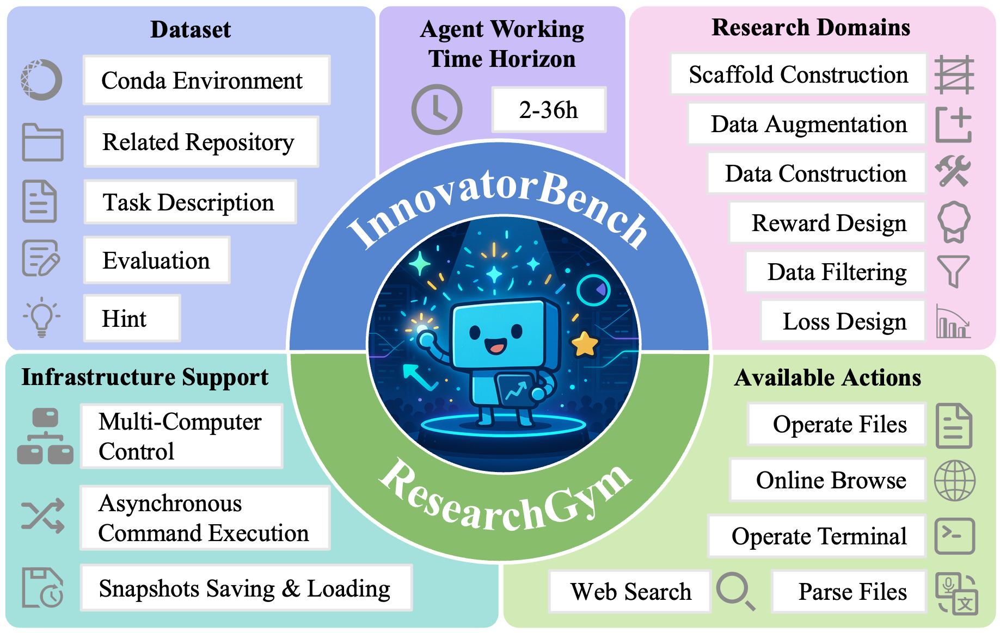

# InnovatorBench: Evaluating Agents' Ability to Conduct Innovative LLM Research

<p align="center">
  
  
  
  
</p>

## 🌟 Recent News

- **2025.10** - Project launch with core architecture and initial evaluation tasks
- **Continuous Updates** - New research tasks and agent implementations welcome

## 📖 Project Overview

**InnovatorBench** is a groundbreaking AI agent benchmarking framework specifically designed to evaluate intelligent agents' ability to conduct innovative LLM research tasks. The project provides a standardized, scalable environment where AI agents can engage in innovative exploration within simulated research scenarios, including:

🔬 **Innovative Research Capability Assessment** - Testing whether AI agents can independently conduct valuable LLM research

🎯 **Standardized Benchmarking** - Providing unified task description, evaluation metrics, and execution environments

🛠️ **Modular Architecture** - Supporting multiple agent types, tool integrations, and environment configurations


### Core Features

- **🧠 Agent Support** - ReAct Agent with context management
- **🏋️ Research Environment Simulation** - ResearchGym provides standardized research workspace
- **🔧 Rich Tool Integration** - Search, browsing, code execution, file operations, file parsing and more
- **💾 State Management** - Checkpoint system supports task interruption recovery
- **📈 Evaluation Framework** - Standardized metrics for assessing agent research outcomes. Support DIY. 


## 🚀 Quick Start

### Installation

1. **Clone the project**
```bash
git clone https://github.com/GAIR-NLP/InnovatorBench.git
cd InnovatorBench
```

2. **Install Conda for Agents and Evaluations**
```bash
# Install Conda
conda create -n ai_innovator python=3.10

pip install -r requirements.txt

# Editable install with no version control (alpaca_eval==0.6.2)
pip install -e alpaca_eval-0.6.2
```
Important: This environemnt also contains the package for evaluation. If you want to use your own agent, you should also set this conda environemnt to start the InnovatorBench evaluation environemnt.

3. **Prepare InnovatorBench Dataset**

- Download InnovatorBench Dataset from [huggingface](https://huggingface.co/datasets/GAIR/InnovatorBench)
- Unzip the Dataset and save it to a path that can be accessed by all computers in the cluster. (Suggest: `./datasets`)
- Download datasets & checkpoints based on README.md in the dataset.
- Copy & Paste `corpus` folder in `task_10` and `task_16`
- Move `evaluations` in InnovatorBench folder. (i.e. `./evaluations`)
- Update `workspace_dataset_path` in the `research_gym/configs/tasks/task_i.yaml` into the real dataset path like `./datasets`


4. **Prepare ResearchGym**
- Set api in `alpaca_eval-0.6.2/client_configs/openai_configs.yaml` (Reference: [alpaca_eval](https://github.com/tatsu-lab/alpaca_eval/blob/main/client_configs/openai_configs_example.yaml))
- Prepare docker, web browse, etc. in [backend](./research_gym/backend/README.md)
- Deploy dockers and web server, update the relative key (`computer_ip`,`web_server_host`)in `research_gym/configs/tasks/task_i.yaml`, each task needs unique computer ips in the same time, but it can use the same web server. (You many need to deploy several dockers at the same time.)
- If all your computers needs proxy to connect each other, set `cmd_proxy_url` in the `research_gym/configs/tasks/task_i.yaml`, otherwise, set it to null
- Update other keys in the `research_gym/configs/tasks/task_i.yaml`
- Set api in `evaluations/base/data_classes.py`

### Configuration

1. Config `agents/config/agent_config.yaml` or `agents/config/agent_config_browse.yaml`
2. Change the config in `research_gym/configs/tasks/task_i.yaml` to your own path/keys.
3. If you want to create your own task, copy `research_gym/configs/tasks/base.yaml`and change the parameter inside it.

### Run

**Run a single task**
```bash
conda activate ai_innovator
cd path_to_InnovatorBench
python main.py -t path_to_env_config -a path_to_agent_config
```


## 🏗️ Project Architecture

```
InnovatorBench/
├── agents/                 # Intelligent Agent System
│   ├── agents/             # Core agent implementations (ReAct, etc.)
│   ├── config/             # Agent configuration files
│   ├── context/            # Context management system
│   └── utils/              # Agent utility functions
├── ResearchGym/            # Research Environment Simulator
│   ├── action/             # Action execution system
│   ├── observation/        # Observation processing system
│   ├── backend/            # The backend used in the ResearchGym
│   ├── applications/       # Application tool integration
│   └── configs/            # Environment configuration
├── evaluations/            # Evaluation Task Collection
│   ├── base/               # Evaluation base classes
│   ├── task_1/             # Task 1: Dataset Construction & Analysis
│   ├── task_2/             # Task 2: Model Training & Optimization
│   └──  ...
├── llm/                    # Large Language Model Integration
│   ├── openai_client.py    # OpenAI API client
│   ├── anthropic_client.py # Anthropic API client
│   └── base_client.py      # Base client interface
├── main.py                 # Main program entry
├── requirements.txt        # Project dependencies
└── ...
```

## 📊 Benchmark Statistics



| **Benchmark**      | **Task Resource**          | **Max Eval times** | **Multi-GPU / Multi-Node** | **Save and Restore** | **Creativity** | **Time Horizon** |
| ------------------ | -------------------------- | ------------------ | -------------------------- | -------------------- | -------------- | ---------------- |
| SWE-bench          | GitHub Issues              | 1                  | ❌                          | ❌                    | ❌              | 30m–2h           |
| ScienceAgentBench  | Scientific Papers          | 1                  | ❌                          | ❌                    | ✅              | 10m              |
| RExBench           | NeurIPS, ACL\*, etc. Paper | 3                  | ❌                          | ❌                    | ❌              | 6h–12h           |
| RE-Bench           | Design Manually            | 1                  | ❌                          | ❌                    | ❌              | 12m–2h           |
| EXP-Bench          | NeurIPS, ICLR Papers       | 1                  | ❌                          | ❌                    | ❌              | 35m              |
| PaperBench         | ICML 2024 Papers           | 1                  | ❌                          | ❌                    | ❌              | 1h–3h            |
| ML-Bench           | Kaggle Competitions        | 1                  | ❌                          | ❌                    | ❌              | Unknown          |
| MLE-bench          | Kaggle ML Tasks            | ∞                  | ❌                          | ❌                    | ✅              | 10m              |
| **InnovatorBench** | NeurIPS, ICLR, etc. Papers | 4                  | ✅                          | ✅                    | ✅              | 2h–36h           |

## 🏆 Leaderboard

*Leaderboard under construction - Agent implementations welcome!*

| Research Domain           | Claude Sonnet 4 |            | GPT-5       |            | GLM-4.5     |            | Kimi-K2     |            |
| ------------------------- | --------------- | ---------- | ----------- | ---------- | ----------- | ---------- | ----------- | ---------- |
|                           | Final Score     | Best Score | Final Score | Best Score | Final Score | Best Score | Final Score | Best Score |
| **Data Construction**     | **25.47**       | **26.88**  | 8.41        | 8.41       | 15.29       | 22.65      | 14.01       | 14.08      |
| **Data Filtering**        | **30.89**       | **31.47**  | 8.97        | 9.48       | 5.16        | 5.36       | 7.39        | 7.97       |
| **Data Augmentation**     | 22.73           | 22.73      | 0.00        | 0.00       | **25.49**   | **25.49**  | 2.47        | 2.47       |
| **Loss Design**           | **12.98**       | **12.98**  | 0.04        | 2.74       | 7.63        | 7.63       | 0.00        | 0.00       |
| **Reward Design**         | **11.56**       | **11.56**  | 0.00        | 0.00       | 0.00        | 0.00       | 3.23        | 3.23       |
| **Scaffold Construction** | 36.63           | 37.74      | **60.07**   | **60.07**  | 3.33        | 3.33       | 3.33        | 3.33       |
| **Weighted Average**      | **24.01**       | **24.54**  | 12.04       | 12.52      | 11.85       | 13.35      | 5.35        | 5.45       |

## 📚 Resources

### Research Papers
- [InnovatorBench: Evaluating Agents' Ability to Conduct Innovative LLM Research](./resources/InnovatorBench.pdf)


## 🤝 Contributing

We welcome contributions of all kinds!

### Submitting New Tasks
1. Create new tasks in the `evaluations/` directory
2. Implement evaluation logic and test cases
3. Submit Pull Request

### Improving Agent Implementations
1. Extend agent types or optimize existing implementations
2. Add new tool integrations
3. Improve context management

### Reporting Issues or Suggestions
- Submit bug reports in GitHub Issues
- Share ideas and suggestions in Discussions

## 📄 License
This project is licensed under the [Apache-2.0 License](LICENSE).

## 🙏 Acknowledgments

We thank the following open source projects and communities:
- [OpenHands](https://github.com/All-Hands-AI/OpenHands)
- [LLaMA-Factory](https://github.com/hiyouga/LLaMA-Factory)
- [verl](https://github.com/volcengine/verl)
- [alpaca_eval](https://github.com/tatsu-lab/alpaca_eval)
- [alignment-handbook](https://github.com/huggingface/alignment-handbook)
- [Visual Sketchpad](https://visualsketchpad.github.io/)
- [Search-R1](https://github.com/PeterGriffinJin/Search-R1)

## 📝 Citation

If you use InnovatorBench in your research, please cite:

```bibtex
@misc{wu2025innovatorbenchevaluatingagentsability,
      title={InnovatorBench: Evaluating Agents' Ability to Conduct Innovative LLM Research}, 
      author={Yunze Wu and Dayuan Fu and Weiye Si and Zhen Huang and Mohan Jiang and Keyu Li and Shijie Xia and Jie Sun and Tianze Xu and Xiangkun Hu and Pengrui Lu and Xiaojie Cai and Lyumanshan Ye and Wenhong Zhu and Yang Xiao and Pengfei Liu},
      year={2025},
      eprint={2510.27598},
      archivePrefix={arXiv},
      primaryClass={cs.AI},
      url={https://arxiv.org/abs/2510.27598}, 
}
```

---

**⭐ If you find this project helpful, please give us a Star!**
